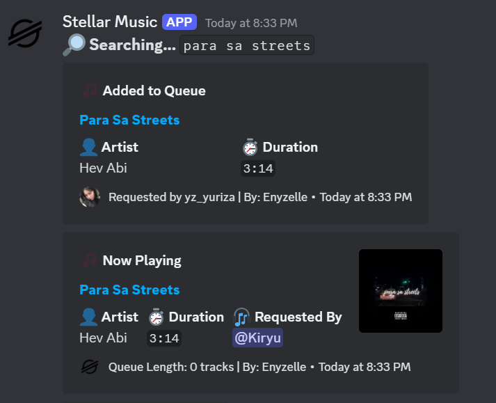
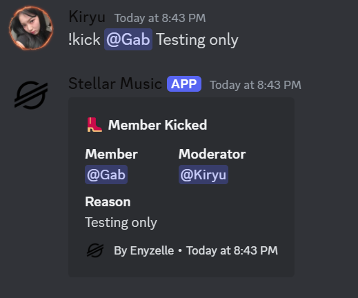
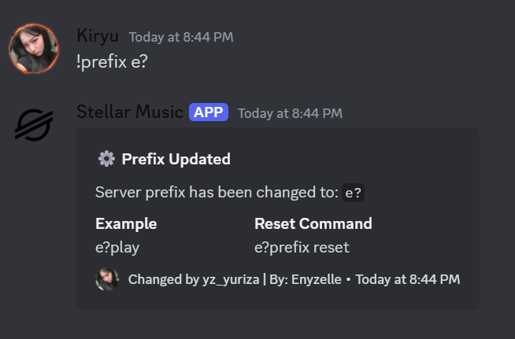
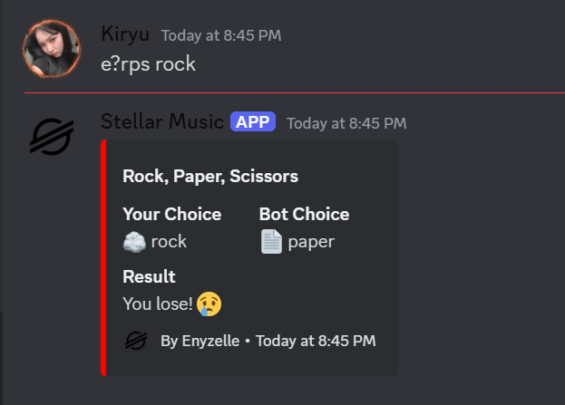

<div align="center">

# 🌟 Stellar Music Bot


*A powerful Discord music bot with DJ system, moderation, and fun commands!*

[](https://discord.js.org)
[](https://github.com/yourusername/stellar-bot/stargazers)
[](LICENSE)
[](https://nodejs.org)
[](https://github.com/Enyzelle/stellar-bot/graphs/commit-activity)

[Invite Bot](https://discord.com/oauth2/authorize?client_id=1323186196289163284&scope=bot&permissions=416619490374) • [Support Server](https://discord.gg/7YkWDEgdr9) • [Documentation](https://github.com/Enyzelle/stellar-bot/wiki)

</div>

---

## ✨ Features

### 🎵 Music System
- **High-Quality Playback** with support for multiple sources
  - YouTube, Spotify, SoundCloud, and more
  - Crystal clear audio quality
  - Volume control and equalizer
- **Advanced Queue Management**
  - Shuffle, loop, and queue manipulation
  - Playlist support
  - Track seeking
- **DJ System**
  - Role-based permissions
  - Vote skip system
  - DJ-only commands

### 🛡️ Moderation Suite
- **Member Management**
  - Ban, kick, timeout
  - Warning system
  - Bulk message deletion
- **Channel Controls**
  - Lockdown functionality
  - Slowmode management
  - Auto-moderation

### 🎮 Fun & Engagement
- **Interactive Commands**
  - 8ball predictions
  - Coin flips & dice rolls
  - Weather information
  - Meme generation
- **Utility Features**
  - Server information
  - User avatars
  - Role information
  - Custom embeds

## 🚀 Getting Started

### Prerequisites
- Node.js 16.9.0 or higher
- Discord Bot Token
- Lavalink Server (for music)

### Installation

1. Clone the repository
```bash
git clone https://github.com/Enyzelle/stellar-bot.git
cd stellar-bot
```

2. Install dependencies
```bash
npm install
```

3. Configure the bot
```bash
cp config.json.example config.json
```

4. Start the bot
```bash
npm start
```

## 📝 Configuration
```json
{
    "token": "YOUR_BOT_TOKEN",
    "clientId": "YOUR_CLIENT_ID",
    "prefix": "!",
    "lavalink": {
        "nodes": [ 
            {
                "host": "localhost",
                "port": 2333,
                "password": "youshallnotpass",
                "secure": false
            }
        ]
    },
    "embedColor": "#2B2D31",
    "owners": ["YOUR_DISCORD_USER_ID"],
    "presence": {
        "status": "dnd",
        "activities": [
            {
                "name": "!help | Stellar",
                "type": "PLAYING"
            }
        ]
    }
}
```

## 📚 Commands

<details>
<summary>🎵 Music Commands</summary>

| Command | Description | Usage |
|---------|-------------|--------|
| `play` | Play a song/playlist | `!play <song>` |
| `skip` | Skip current track | `!skip` |
| `forceskip` | Force skip (DJ only) | `!forceskip` |
| `queue` | View music queue | `!queue [page]` |
| `remove` | Remove song from queue | `!remove <position>` |
| `shuffle` | Shuffle the queue | `!shuffle` |
| `volume` | Adjust volume | `!volume <0-100>` |
| `pause` | Pause the current track | `!pause` |
| `resume` | Resume the current track | `!resume` |
| `stop` | Stop the music player | `!stop` |
| `seek` | Seek to a specific time | `!seek <time>` |
| `nowplaying` | View currently playing song | `!nowplaying` |
| `loop` | Loop the current track | `!loop <on/off>` |
| `lyrics` | Get song lyrics | `!lyrics [song]` |

</details>

<details>
<summary>🛡️ Moderation Commands</summary>

| Command | Description | Usage |
|---------|-------------|--------|
| `ban` | Ban a member | `!ban @user [reason]` |
| `kick` | Kick a member | `!kick @user [reason]` |
| `timeout` | Timeout a member | `!timeout @user <duration> [reason]` |
| `warn` | Warn a member | `!warn @user [reason]` |
| `clear` | Clear messages | `!clear <amount>` |
| `slowmode` | Set channel slowmode | `!slowmode <seconds>` |
| `lockdown` | Lock/unlock channel | `!lockdown <on/off>` |

</details>

<details>
<summary>🎮 Fun Commands</summary>

| Command | Description | Usage |
|---------|-------------|--------|
| `meme` | Get a random meme | `!meme` |
| `ascii` | Convert text to ASCII | `!ascii <text>` |
| `weather` | Get weather info | `!weather <location>` |
| `roll` | Roll a dice | `!roll [sides]` |
| `rps` | Play Rock Paper Scissors | `!rps <rock/paper/scissors>` |
| `coinflip` | Flip a coin | `!coinflip` |
| `say` | Make the bot say something | `!say <message>` |
| `8ball` | Get a random 8ball prediction | `!8ball <question>` |

</details>

<details>
<summary>🛠️ Utility Commands</summary>

| Command | Description | Usage |
|---------|-------------|--------|
| `avatar` | Get user's avatar | `!avatar [@user]` |
| `userinfo` | Get user information | `!userinfo [@user]` |
| `serverinfo` | Get server information | `!serverinfo` |
| `roleinfo` | Get role information | `!roleinfo <@role/ID>` |
| `botinfo` | Get bot information | `!botinfo` |
| `ping` | Check bot's latency | `!ping` |

</details>

<details>
<summary>⚙️ Configuration Commands</summary>

| Command | Description | Usage |
|---------|-------------|--------|
| `prefix` | Change server prefix | `!prefix <new_prefix>` |
| `dj` | Manage DJ role | `!dj <set/remove/info> [@role]` |

</details>

### Command Arguments
- `<>` = Required argument
- `[]` = Optional argument
- `()` = Choose one
- `/` = Or

### Permission Levels
- 🎵 = Everyone
- 🎭 = DJ Role
- ⚔️ = Moderator
- 👑 = Administrator
- 💻 = Bot Owner

## 🎨 Features Showcase

<div align="center">




</div>

## 🤝 Contributing

Contributions are welcome! Here's how you can help:

1. Fork the repository
2. Create a feature branch (`git checkout -b feature/AmazingFeature`)
3. Commit your changes (`git commit -m 'Add AmazingFeature'`)
4. Push to the branch (`git push origin feature/AmazingFeature`)
5. Open a Pull Request

## 📋 To-Do List

- [ ] Slash command support
- [ ] Web dashboard
- [ ] Custom playlists
- [ ] More audio filters
- [ ] Auto-DJ feature

## 📜 License

This project is licensed under the MIT License - see the [LICENSE](LICENSE) file for details.

## 💖 Support

If you find this bot helpful, please consider:
- Giving it a ⭐ star on GitHub
- Joining our [support server](https://discord.gg/7YkWDEgdr9)
- Contributing to its development

---

## 📞 Contact

- 📧 Email: [Enyz](enyz.contact@gmail.com)
- 📸 IG: [@enyzelle](https://instagram.com/enyzelle)
- 🤝 Discord: [yz.yuriza](https://discord.com/users/1317482100290752604)
- 💬 Discord Server: [Join our community](https://discord.gg/7YkWDEgdr9)

---

## 🙏 Acknowledgments

- [Discord.js](https://discord.js.org/) - JavaScript Discord API
- [Riffy](https://github.com/riffy-team/riffy) - Riffy API
- All contributors who help improve this project

---
<div align="center">
  
<div align="center">
  Made with ❤️ by Enyzelle
</div>

<a href="https://discord.gg/7YkWDEgdr9">
  
</a>

</div>
